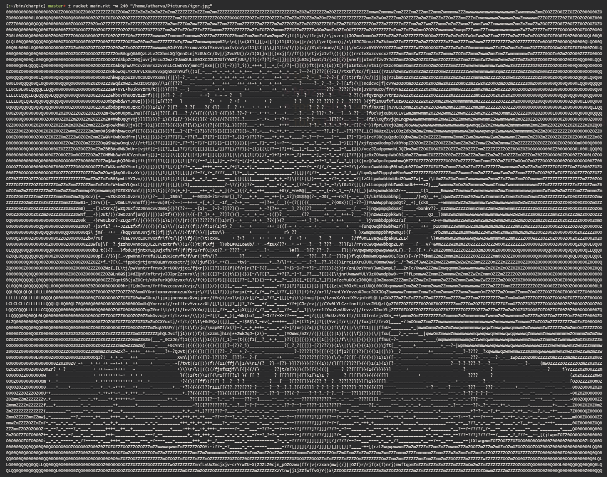

# charpic
*(pronounced like charming + harpic)*

This program turns a bitmap image into ascii art on your terminal

Works better with contrasty images.

## Usage
```
charpic [ <option> ... ] <path>
 where <option> is one of
  -w, --width : Set the width of pictures in characters
```

## Examples



## Install

1. [Get Racket](https://download.racket-lang.org)
2. Get this repo into your preferred directory

```
git clone https://github.com/tfidfwastaken/charpic.git
```

3. Create the executable within the cloned directory

```
raco exe -o charpic main.rkt
```

4. Put this line in your `.bashrc` if you want to access the program from anywhere:

```
export PATH="$PATH:./charpic"
```
